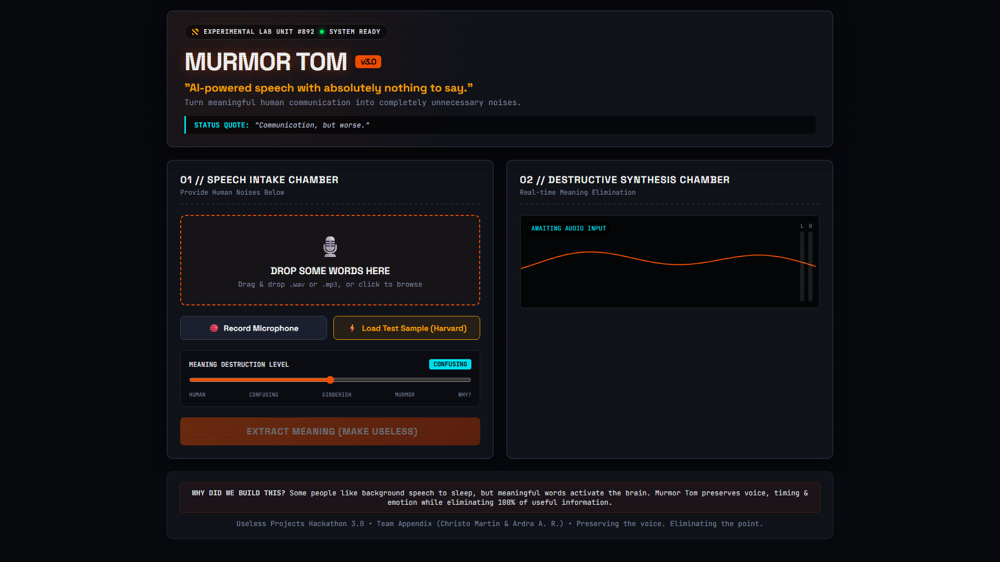
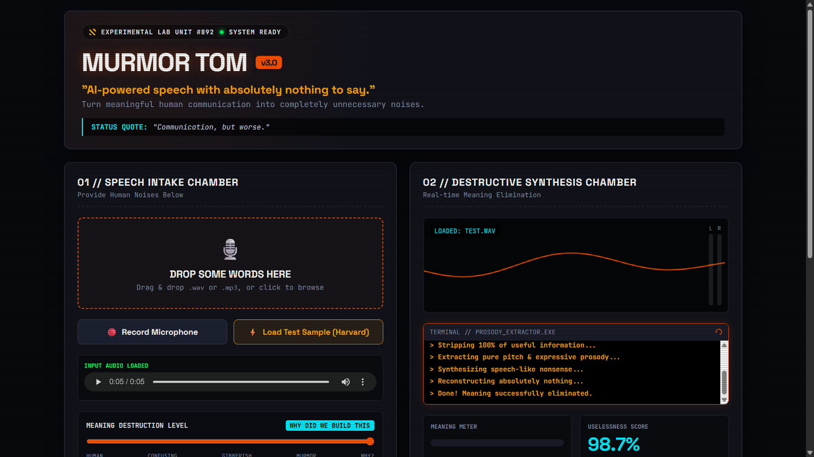
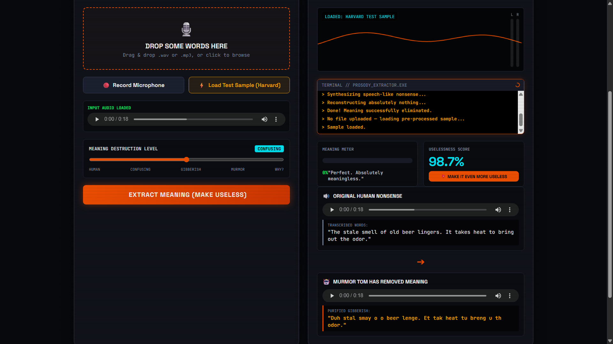

# The Mumble Box 🎯

> *"AI-powered speech with absolutely nothing to say."*

## Basic Details
### Team Name: Appendix

### Team Members
- **Team Lead:** Christo Martin — NSS College of Engineering
- **Member 2:** Ardra A. R. — NSS College of Engineering

### Hosted Project
🌐 **[Live Demo on GitHub Pages](https://christo-martin.github.io/useless_project_Appendix/)**

---

### The Problem (that doesn't exist)
Have you ever been peacefully listening to something when, all of a sudden, the words start making **sense**?
Now you're forced to process them. Understand them. Maybe even *think* about them.

The Mumble Box puts an end to this terrible burden.

### The Solution (that nobody asked for)
We asked ourselves: *What if speech could sound exactly like speech, without having the audacity to mean anything?*

The Mumble Box takes ordinary human speech, **throws away the meaning**, and reconstructs it as convincing gibberish — while perfectly preserving the speaker's rhythm, timing, pauses, and expressive flow.

**All the talking. None of the information.**

---

## Technical Details

### Technologies / Components Used

**Languages**
- Python 3.10+
- JavaScript (ES2020, vanilla)
- HTML5 / CSS3

**Frameworks & Libraries**
| Library | Purpose |
|---------|---------|
| [WhisperX](https://github.com/m-bain/whisperX) | GPU-accelerated transcription + millisecond-accurate word alignment |
| [Coqui TTS / XTTS v2](https://github.com/coqui-ai/TTS) | Zero-shot multilingual voice cloning |
| [librosa](https://librosa.org/) | Time-stretching synthesised segments to match original timing |
| [soundfile](https://python-soundfile.readthedocs.io/) | Reading and writing WAV files |
| [FastAPI](https://fastapi.tiangolo.com/) | REST backend that connects the web UI to the Python pipeline |
| [uvicorn](https://www.uvicorn.org/) | ASGI server for FastAPI |
| Web Speech API | In-browser audio visualiser |

**Tools**
- NVIDIA CUDA 12 (GPU inference for WhisperX & XTTS)
- Git / GitHub Pages (static hosting)

---

### How It Works

```
┌─────────────────────────────────────────────────────────────┐
│                        MURMOR TOM                           │
│                                                             │
│   Input WAV ──► WhisperX ──► aligned_segments.json          │
│                  (align.py / run_align.py)                  │
│                                │                            │
│                                ▼                            │
│              gibberish_for_segment(text, level=1..5)        │
│              ┌──────────────────────────────────────────┐   │
│              │ 1 – Near-homophones  (vowel shift only)  │   │
│              │ 2 – First-letter preserved gibberish     │   │
│              │ 3 – Syllable-matched random phonemes     │   │
│              │ 4 – Noisier, wilder phoneme pool         │   │
│              │ 5 – Syllable count ±1, maximum chaos     │   │
│              └──────────────────────────────────────────┘   │
│                                │                            │
│                                ▼                            │
│              XTTS v2 voice clone (speaker ref = input WAV)  │
│                                │                            │
│                                ▼                            │
│              librosa time-stretch → placed at original      │
│              timestamp in the output track                  │
│                                │                            │
│                                ▼                            │
│                         Output WAV 🎉                       │
└─────────────────────────────────────────────────────────────┘
```

**The "Meaning Destruction Level" slider** (1–5) controls `gibberish_for_segment()` in `gibberish.py`. Level 1 sounds vaguely familiar; level 5 is pure phonetic chaos.

---

### Implementation

#### Prerequisites
- Python 3.10 or 3.11
- NVIDIA GPU with CUDA 12 (CPU works but is very slow)
- `ffmpeg` installed and on PATH

#### Installation

```bash
# 1. Clone the repo
git clone https://github.com/Christo-Martin/useless_project_Appendix.git
cd useless_project_Appendix

# 2. Create and activate a virtual environment
python -m venv .venv
source .venv/bin/activate   # Windows: .venv\Scripts\activate

# 3. Install Python dependencies
pip install -r requirements.txt

# 4. (One-time) Download the XTTS v2 model
python -c "from TTS.api import TTS; TTS('tts_models/multilingual/multi-dataset/xtts_v2')"
```

#### Running the CLI pipeline

```bash
cd src

# Step 1 — Transcribe & align (produces ../aligned_segments.json)
python run_align.py

# Step 2 — Synthesise gibberish (reads aligned_segments.json, writes ../output_audios/dubbed_output.wav)
python run_synthesize.py
```

To change the source audio, edit the `SOURCE_AUDIO` constant at the top of each script.

#### Running the web UI with the live backend

```bash
# Start the FastAPI server (keep this terminal open)
cd src
python server.py
# → Listening on http://0.0.0.0:8000

# Open index.html in your browser (or use the GitHub Pages URL)
# Upload any .wav or .mp3 file, set the slider, click "EXTRACT MEANING"
```

The slider value (1–5) is sent as a form field `level` to `POST /process`, which calls `synthesize(..., level=level)` → `gibberish_for_segment(text, level=level)`.

---

### Project Documentation

#### Screenshots


 > Drop-zone + audio preview before processing 

>Terminal log during synthesis

>Side-by-side comparison of original vs. gibberish 

#### Architecture Diagram

```
Browser (GitHub Pages)
        │
        │  POST /process  {file, level}
        ▼
   FastAPI server.py  (localhost:8000)
        │
        ├─► align.py        — WhisperX transcription + alignment
        │        └─► aligned_segments.json
        │
        └─► run_synthesize.py  — per-segment synthesis loop
                 ├─► gibberish.py   — level-aware text transform
                 └─► XTTS v2        — voice clone + time-stretch
                          └─► output_gibberish.wav  ──► browser
```

---

### Project Demo

<a href="https://drive.google.com/file/d/1ggbsx-MolcH3qAeivBEjA1hC0l-wYxAJ/view?usp=sharing">Demo video</a>


**What the demo shows:**
- Uploading a short voice clip
- Adjusting the "Meaning Destruction Level" slider from 1 (barely confusing) to 5 (complete chaos)
- Hearing the synthesised gibberish in the speaker's cloned voice

---

## Team Contributions
- **Christo Martin** — Pipeline architecture, WhisperX alignment, gibberish generation algorithm, XTTS voice-cloning integration
- **Ardra A. R.** — ,  frontend (UI/JS), testing & QA,  FastAPI server

---

Made with ❤️ at TinkerHub Useless Projects


